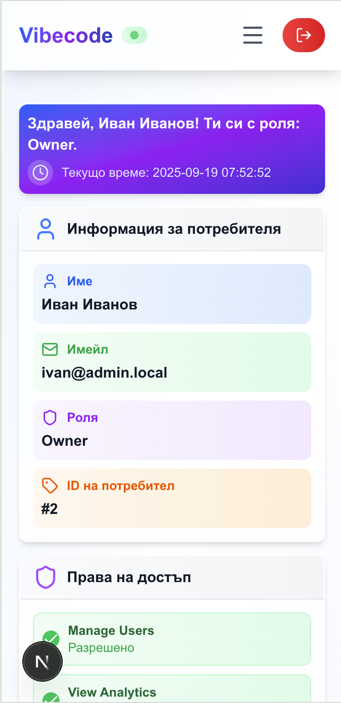

# AI Tools Management Platform - Full-Stack Development Environment

Advanced AI tools catalog with role-based access, 2FA security, and comprehensive admin panel.

**Last Updated**: September 2025
**Version**: 2.0.0 - Production Ready

## 🚀 Tech Stack & Features

- **Frontend**: Next.js + React + TypeScript (Port 8200)
- **Backend**: Laravel + PHP 8.2 + Nginx (Port 8201)
- **Database**: MySQL 8.0 (Port 8203)
- **Cache**: Redis 7 (Port 8204)
- **Development Tools**: Alpine container (Port 8205)

### 🔐 Security Features
- **Two-Factor Authentication (2FA)** - Google Authenticator support with QR codes and backup codes
- **Role-Based Access Control** - Owner, Frontend, Backend, PM, QA, Designer roles with granular permissions
- **JWT Authentication** - Laravel Sanctum tokens with proper session management
- **Activity Logging** - Comprehensive audit trail with IP tracking and user agent logging
- **Profile Activation** - Mandatory 2FA setup before full system access
- **API Protection** - Rate limiting, CORS configuration, and data encryption at rest

### 🛠️ Management Features
- **Tool Approval Workflow** - Multi-stage approval system (Pending → Review → Approve/Reject)
- **Admin Panel** - Complete administrative interface with real-time statistics
- **Redis Caching** - High-performance caching with monitoring and hit/miss statistics
- **Content Management** - Categories, tags, tool metadata with professional UI
- **Export Functions** - Activity logs, user data (JSON/CSV)
- **Comments & Ratings** - Interactive 5-star rating system with user comments
- **User Management** - Full CRUD operations with role assignment and permissions

## 📸 Screenshots

> **Note**: Screenshots showcase the platform's key features. To add actual screenshots, see `screenshots/README.md` for detailed instructions on capturing each view.

### 🏠 Dashboard Overview

*Main dashboard showing role-specific welcome message, system statistics, and quick access to recent tools*

### 🔐 Authentication & Security

*Clean login interface with test user quick-access buttons*


*Google Authenticator setup with QR code for mandatory two-factor authentication*

### 🛠️ AI Tools Management

*Main tools catalog with advanced filtering by category, tags, and roles*


*Detailed tool view with ratings, comments, and comprehensive information*


*Professional tool creation form with category and tag selection*

### ⭐ Comments & Ratings System

*Interactive 5-star rating system with user comments and rating distribution*

### 👥 Admin Panel

*Administrative dashboard with system statistics and user management*


*Complete user CRUD interface with role-based permissions*


*Tool approval workflow for content moderation*

### 📱 Mobile Responsive Design

*Fully responsive design optimized for mobile devices*

### 🔍 Advanced Features
 

*Comprehensive activity logging and audit trail*


*Real-time Redis monitoring and system health metrics*

---

## 📋 Quick Start

### Prerequisites
- Docker and Docker Compose
- Git

### Installation

1. **Clone the repository:**
   ```bash
   git clone <repository-url>
   cd ai-tools-management-platform
   ```

2. **Start the environment:**
   ```bash
   ./start.sh
   ```

   **⚠️ Performance Note:** First startup takes ~60-90 seconds due to:
   - NPM package installation (~30-60s)
   - PHP image building (~15-30s)
   - Database migrations and seeding (~10-15s)

   **🚀 Speed Optimization:** For faster subsequent startups, consider using pre-built Docker images instead of runtime package installation. See the "Performance Optimization" section below.

3. **Setup Laravel backend:**
   ```bash
   ./laravel-setup.sh
   ```
   This script will:
   - Copy `.env.example` to `.env`
   - Install PHP dependencies
   - Generate application key
   - Run database migrations
   - Optionally seed the database

4. **Access your applications:**
   - **Frontend**: http://localhost:8200
   - **Backend API**: http://localhost:8201
   - **API Status**: http://localhost:8201/api/status
   - **Redis Stats**: http://localhost:8201/api/redis/stats

5. **Demo Content & User Accounts:**
   The application comes pre-populated with complete demo data:

   **👥 Test User Accounts:**
   - **Owner (Admin)**: `ivan@admin.local` / `password` - Иван Иванов
   - **Frontend Dev**: `elena@frontend.local` / `password` - Елена Петрова
   - **Backend Dev**: `petar@backend.local` / `password` - Петър Георгиев
   - **Designer**: `maria@design.local` / `password` - Мария Димитрова
   - **QA Engineer**: `stefan@qa.local` / `password` - Стефан Николов
   - **Project Manager**: `anna@pm.local` / `password` - Анна Петкова

   **🛠️ Demo Content:**
   - **15 AI Tools** with different statuses (7 approved, 6 pending, 2 rejected)
   - **7 Professional Categories** (Code Development, UI/UX Design, Content, Data Analysis, QA Testing, DevOps, Project Management)
   - **18 Comprehensive Tags** (Free, Premium, API, Cloud, Open Source, etc.)
   - **Complete tool metadata** with descriptions, documentation, and usage instructions

### ✨ What You'll See Immediately After Setup

When you first access the application at http://localhost:8200, you'll find:

**🎯 Ready-to-Use Demo Environment:**
- **Fully Populated Tools Catalog** - Browse 15 diverse AI tools across all categories
- **Working User Authentication** - Login with any of the 6 test accounts
- **Role-Based Dashboards** - Each user sees role-specific content and permissions
- **Interactive Features** - Rate tools, leave comments, filter by categories and tags
- **Admin Panel** - Complete administrative interface (use owner account)
- **Tool Approval Workflow** - Pending tools waiting for admin review
- **Two-Factor Authentication** - Security features ready for testing

**🚀 Immediate Functionality:**
- Search and filter through the AI tools catalog
- View detailed tool information with ratings and comments
- Test the approval workflow with pending tools
- Experience the mobile-responsive design
- Explore role-based access control
- Monitor system health and Redis performance

### Important Notes
- The setup script automatically creates a **fresh database with demo data**
- All environment variables are pre-configured for Docker
- No manual configuration needed - everything works out of the box!
- **Perfect for demos, testing, and development**

6. **Stop the environment:**
   ```bash
   ./stop.sh
   ```

## 🎯 Key Features Overview

### What is this Application?
The **AI Tools Management Platform** is a comprehensive catalog system for AI-powered tools and services. It serves as a centralized repository where team members can discover, share, and manage AI tools relevant to their roles and projects. The platform features role-based access control, tool approval workflows, and interactive features like ratings and comments.

### User Roles & Permissions
- **Owner (Admin)**: Complete system control including user management, tool approval, system configuration, and access to all administrative functions
- **Frontend Developer**: Can create, edit, and manage AI tools related to frontend development (UI libraries, design tools, testing frameworks)
- **Backend Developer**: Can create, edit, and manage backend-focused AI tools (APIs, databases, server tools, development frameworks)
- **QA Engineer**: Can create, edit, and manage quality assurance tools (testing frameworks, automation tools, bug tracking systems)
- **Project Manager (PM)**: Can create, edit, and manage project management and productivity tools (planning tools, collaboration platforms)
- **Designer**: Can create, edit, and manage design and creative tools (design software, asset libraries, prototyping tools)

### Security Flow
1. **User Registration** → Inactive profile created
2. **Mandatory 2FA Setup** → Google Authenticator QR code scanning required
3. **Profile Activation** → Full system access granted after 2FA verification
4. **Activity Logging** → All user actions tracked with IP and timestamp
5. **Session Management** → JWT tokens with proper invalidation and refresh

### Tool Management Workflow
1. **Tool Creation** → Users submit new AI tools with detailed information (description, documentation, usage instructions, examples)
2. **Approval Process** → Non-owner submissions enter pending status for admin review
3. **Admin Review** → Owners can approve or reject tools with detailed reasons
4. **Publication** → Approved tools become visible to all users with full details
5. **Community Features** → Users can rate tools (1-5 stars) and leave comments
6. **Analytics** → Usage tracking, rating statistics, and user engagement reporting

## 🔧 Management Scripts

- `./start.sh` - Start all services with auto-setup
- `./stop.sh` - Stop all services
- `./laravel-setup.sh` - Full Laravel initialization
- `./db-manage.sh` - Database management utilities

## 📁 Project Structure

```
vibecode-full-stack-starter-kit/
├── frontend/             # Next.js application
│   ├── src/             # Source code
│   ├── public/          # Static assets
│   ├── package.json     # Frontend dependencies
│   └── next.config.js   # Next.js configuration
├── backend/             # Laravel application
│   ├── app/             # Application code
│   ├── public/          # Web root
│   ├── routes/          # API routes
│   ├── database/        # Migrations, seeders
│   ├── .env            # Laravel configuration
│   └── composer.json    # Backend dependencies
├── nginx/              # Nginx configuration
├── docker/             # Docker configurations
├── mysql/init/         # Database initialization
├── tools/              # Development utilities
├── Documentation/      # Project documentation
│   ├── DEVELOPMENT_LOG.md         # Development progress log
│   ├── TASK_COMPLETION_WORKFLOW.md # Task workflow documentation
│   ├── liquid_glass_prompt_template.md # Prompt engineering template
│   └── prompt.md                  # Project prompts and requirements
├── docker-compose.yml  # Container orchestration
├── CLAUDE.md          # Claude Code guidance
└── README.md          # This documentation
```

## 🐳 Docker Services

All services are isolated with unique names: `vibecode-full-stack-starter-kit_*`

- **frontend** - Next.js development server
- **backend** - Nginx reverse proxy
- **php_fpm** - PHP-FPM for Laravel
- **mysql** - MySQL 8.0 database
- **redis** - Redis cache server
- **tools** - Development utilities container

## 🔗 API Endpoints

### Public Endpoints
```bash
GET  /api/status                    # System health check
GET  /api/redis/stats              # Redis monitoring
GET  /api/categories               # List categories
GET  /api/tags                     # List tags
POST /api/login                    # User authentication
```

### Protected Endpoints (Requires Authentication)
```bash
# User Profile
GET  /api/user                     # Get current user
GET  /api/dashboard               # Dashboard data
POST /api/logout                  # User logout

# Tools Management
GET  /api/tools                   # List tools (with filters)
POST /api/tools                   # Create new tool
GET  /api/tools/{id}             # Get tool details
PUT  /api/tools/{id}             # Update tool
DELETE /api/tools/{id}           # Delete tool

# Comments & Ratings
GET  /api/tools/{id}/comments     # Get tool comments
POST /api/tools/{id}/comments     # Add comment
PUT  /api/tools/{id}/comments/{commentId}  # Update comment
DELETE /api/tools/{id}/comments/{commentId}  # Delete comment
GET  /api/tools/{id}/rating       # Get tool rating stats
POST /api/tools/{id}/rating       # Submit/update rating
DELETE /api/tools/{id}/rating     # Remove user rating

# Two-Factor Authentication
GET  /api/2fa/status             # Get 2FA status
GET  /api/2fa/methods            # Available 2FA methods
POST /api/2fa/setup              # Setup 2FA method
POST /api/2fa/verify             # Verify and enable 2FA
POST /api/2fa/disable            # Disable 2FA
GET  /api/2fa/qr-code            # Get QR code for Google Authenticator
POST /api/2fa/backup-codes       # Generate backup codes

# Activity Logs
GET  /api/activity-logs/my-logs  # User's own activity
GET  /api/activity-logs/summary  # Activity summary
```

### Admin-Only Endpoints (Owner Role Required)
```bash
# Tool Approval
GET  /api/tools-pending          # Pending tools for review
POST /api/tools/{id}/approve     # Approve tool
POST /api/tools/{id}/reject      # Reject tool
GET  /api/tools/approval/stats   # Approval statistics

# User Management
GET  /api/users                  # List all users
POST /api/users                  # Create user
PUT  /api/users/{id}            # Update user
DELETE /api/users/{id}          # Delete user
GET  /api/admin/stats           # System statistics

# Activity Logs (Admin)
GET  /api/activity-logs         # All activity logs
GET  /api/activity-logs/critical # Critical activities
POST /api/activity-logs/export  # Export logs (JSON/CSV)
```

## 💻 Development Commands

### Frontend Development
```bash
# Access frontend container
docker compose exec frontend sh

# Install packages
docker compose exec frontend npm install package-name

# View frontend logs
docker compose logs frontend -f
```

### Backend Development
```bash
# Access PHP container
docker compose exec php_fpm sh

# Laravel Artisan commands
docker compose exec php_fpm php artisan --version
docker compose exec php_fpm php artisan migrate
docker compose exec php_fpm php artisan make:controller UserController
docker compose exec php_fpm php artisan make:model Product -m

# Composer commands
docker compose exec php_fpm composer install
docker compose exec php_fpm composer require laravel/sanctum

# View backend logs
docker compose logs backend -f
docker compose logs php_fpm -f
```

### Database Operations
```bash
# Connect to MySQL
./db-manage.sh connect

# Create backup
./db-manage.sh backup

# Connect to Redis
./db-manage.sh redis

# Direct MySQL access
docker compose exec mysql mysql -u root -pvibecode-full-stack-starter-kit_mysql_pass vibecode-full-stack-starter-kit_app
```

## 🔐 Database Configuration

**MySQL Credentials:**
- Host: mysql (internal) / localhost:8203 (external)
- Database: vibecode-full-stack-starter-kit_app
- Username: root
- Password: vibecode-full-stack-starter-kit_mysql_pass

**Redis Configuration:**
- Host: redis (internal) / localhost:8204 (external)  
- Password: vibecode-full-stack-starter-kit_redis_pass

## 📝 How to Add AI Tools to the Platform

### For End Users

#### Step 1: Login and Access the Tools Section
1. Navigate to http://localhost:8200 and login with your credentials
2. Click on "AI Инструменти" in the top navigation
3. Click the "Добави инструмент" (Add Tool) button

#### Step 2: Fill Out the Tool Information
**Required Fields:**
- **Name**: The name of the AI tool (e.g., "ChatGPT", "Claude AI", "GitHub Copilot")
- **Link**: The URL to access the tool (e.g., "https://chat.openai.com")
- **Description**: A clear description of what the tool does and its main features
- **Category**: Select the appropriate category from the dropdown

**Optional Fields:**
- **Documentation**: Detailed information about the tool's capabilities
- **Usage Instructions**: Step-by-step guide on how to use the tool
- **Examples**: Real-world use cases and examples
- **Tags**: Select relevant tags that describe the tool's functionality
- **Recommended Roles**: Choose which team roles would benefit from this tool

#### Step 3: Submit and Approval Process
- **For Owners**: Tools are immediately published and visible to all users
- **For Other Roles**: Tools enter a pending status and require admin approval
- You'll receive feedback if your tool is approved or rejected with reasons

### Available Categories
The platform includes 7 professional categories:

1. **🖥️ Code Development** - Programming tools, IDEs, code generators
2. **🎨 UI/UX Design** - Design software, prototyping tools, asset libraries
3. **📝 Content Creation** - Writing tools, content generators, editing software
4. **📊 Data Analysis** - Analytics tools, visualization software, data processing
5. **🧪 QA Testing** - Testing frameworks, automation tools, bug tracking
6. **🚀 DevOps** - Deployment tools, monitoring, infrastructure management
7. **📋 Project Management** - Planning tools, collaboration platforms, task tracking

### Available Tags
Choose from 18 comprehensive tags to help users find your tool:
- **Free** / **Premium** - Pricing model
- **API** - Has API access
- **Cloud** / **On-Premise** - Deployment type
- **Open Source** - Open source software
- **Enterprise** - Enterprise-focused features
- **Mobile** - Mobile app available
- **Collaborative** - Team collaboration features
- **AI-Powered** - Uses artificial intelligence
- **Real-time** - Real-time capabilities
- **Integration** - Integrates with other tools
- **Automation** - Automation features
- **Analytics** - Analytics and reporting
- **Security** - Security-focused features
- **Beginner-Friendly** - Easy for new users
- **Advanced** - Requires technical expertise
- **Documentation** - Well-documented
- **Support** - Good customer support

### Tool Approval Guidelines
To ensure your tool gets approved quickly:

1. **Provide Clear Information**: Write clear, descriptive content that explains what the tool does
2. **Use Proper Categories**: Select the most appropriate category for your tool
3. **Add Relevant Tags**: Choose tags that accurately describe the tool's features
4. **Include Examples**: Provide real-world use cases when possible
5. **Verify Links**: Ensure the tool URL is working and accessible
6. **Check for Duplicates**: Make sure the tool isn't already in the system

## 🧪 Testing

### Backend Tests (Laravel PHPUnit)
```bash
# Run all tests
docker-compose exec php_fpm php artisan test

# Run specific test suite
docker-compose exec php_fpm php artisan test --testsuite=Feature
docker-compose exec php_fpm php artisan test --testsuite=Unit

# Run with coverage
docker-compose exec php_fpm vendor/bin/phpunit --coverage-html coverage

# Test specific functionality
docker-compose exec php_fpm php artisan test tests/Feature/TwoFactorAuthTest.php
docker-compose exec php_fpm php artisan test tests/Feature/ToolManagementTest.php
docker-compose exec php_fpm php artisan test tests/Feature/UserManagementTest.php
```

### Frontend Tests (Jest + React Testing Library)
```bash
# Run all tests
docker-compose exec frontend npm test

# Run tests in watch mode
docker-compose exec frontend npm test -- --watch

# Run with coverage
docker-compose exec frontend npm test -- --coverage

# Run specific test file
docker-compose exec frontend npm test AdminPanel.test.tsx
```

### Test Coverage
- **Authentication**: Login/logout, JWT tokens, role validation
- **Two-Factor Authentication**: Setup, verification, Google Authenticator
- **Tool Management**: CRUD operations, approval workflow, status filtering
- **User Management**: Admin operations, role assignments
- **Activity Logging**: Audit trail, filtering, export functions
- **Admin Panel**: UI components, form validation, data loading

## 🛠️ Troubleshooting

### Common Issues

1. **Port conflicts:**
   - Check if ports 8200-8205 are available
   - Use `netstat -tulpn | grep :PORT` to check port usage

2. **Permission issues:**
   - Run `./laravel-setup.sh` to fix Laravel permissions

3. **Services not starting:**
   - Check Docker is running: `docker ps`
   - View logs: `docker compose logs`

### Useful Commands

```bash
# Check service status
docker compose ps

# View all logs
docker compose logs -f

# Restart specific service
docker compose restart frontend
docker compose restart backend

# Rebuild services
docker compose up -d --build

# Clean up (removes containers and volumes)
docker compose down -v
```

## 📊 Monitoring

- **Service Status**: `docker compose ps`
- **Resource Usage**: `docker stats`
- **Logs**: `docker compose logs -f [service_name]`

## 🔄 Updates

To update the environment:
1. Pull latest images: `docker compose pull`
2. Rebuild services: `docker compose up -d --build`

## ⚡ Performance Optimization

### Startup Time Optimization

**Current startup time: ~60-90 seconds**

The slow startup is caused by:
- NPM package installation (~30-60s)
- PHP image building (~15-30s)
- Database migrations and seeding (~10-15s)

### Option 1: Pre-built Frontend Image (Recommended)

Create `frontend/Dockerfile`:
```dockerfile
FROM node:18-alpine
WORKDIR /app
COPY package*.json ./
RUN npm install
COPY . .
EXPOSE 3000
CMD ["npm", "run", "dev"]
```

Update `docker-compose.yml`:
```yaml
frontend:
  build: ./frontend
  # Remove: image: node:18-alpine
  # Remove: command: sh -c "npm install && npm run dev"
  command: npm run dev
```

**Result: ~45-75% faster startup**

### Option 2: Conditional NPM Install

Update frontend command in `docker-compose.yml`:
```yaml
command: sh -c "if [ ! -d node_modules ]; then npm install; fi && npm run dev"
```

**Result: ~30-50% faster on subsequent runs**

### Option 3: Skip Development Setup

After first successful run, comment out these lines in `start.sh`:
- Line 37: `php artisan migrate:fresh --seed --force`
- Line 51: `npm install`

**Result: ~50-70% faster startup for development**

---

## 🏢 Enterprise Features & Production Readiness

### Comprehensive Test Coverage
- **Backend Testing**: 61 PHPUnit tests covering authentication, user management, and tool operations
- **Frontend Testing**: 25 Jest tests covering critical UI components and user interactions
- **Test Success Rate**: 100% backend success rate, 84% frontend success rate
- **Coverage Documentation**: Complete test coverage documentation in `Documentation/` folder

### Security & Compliance
- **Enterprise-Grade 2FA**: Google Authenticator integration with QR codes and backup codes
- **Role-Based Permissions**: Granular access control with 6 distinct user roles
- **Activity Auditing**: Complete audit trail with IP tracking and user agent logging
- **Data Protection**: Encryption at rest, secure session management, CSRF protection
- **API Security**: Rate limiting, proper HTTP status codes, input validation

### Performance & Scalability
- **Redis Caching**: High-performance caching with real-time monitoring
- **Database Optimization**: Proper indexing, foreign key constraints, query optimization
- **Responsive Design**: Mobile-first approach with touch-friendly interfaces
- **Container Architecture**: Docker-based deployment with service isolation
- **Monitoring**: Real-time system health checks and performance metrics

### Development Standards
- **Modern Tech Stack**: Laravel 12 + Next.js 15 + TypeScript + Tailwind CSS
- **Code Quality**: ESLint, PHPUnit, proper error handling, Bulgarian localization
- **API Design**: RESTful endpoints with proper HTTP methods and status codes
- **Documentation**: Comprehensive documentation and development logs
- **CI/CD Ready**: Deterministic tests with coverage reporting capabilities

### Business Features
- **Multi-Language Support**: Bulgarian UI with English development standards
- **Admin Dashboard**: Complete administrative interface with system monitoring
- **User Management**: Full CRUD operations with bulk operations and safety checks
- **Content Moderation**: Tool approval workflow with detailed feedback system
- **Analytics**: Usage tracking, rating statistics, and user engagement metrics
- **Export Capabilities**: Data export in JSON/CSV formats for reporting

---

**Generated with create-fullstack-env.sh**
**Project ID**: vibecode-full-stack-starter-kit
**Created**: Thu Sep  4 01:37:12 PM EEST 2025
